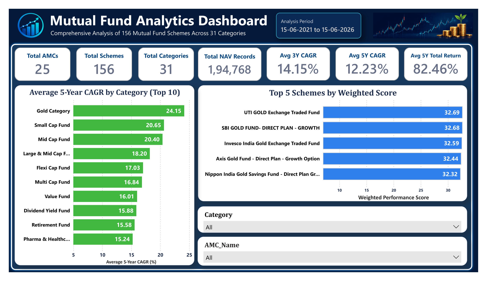
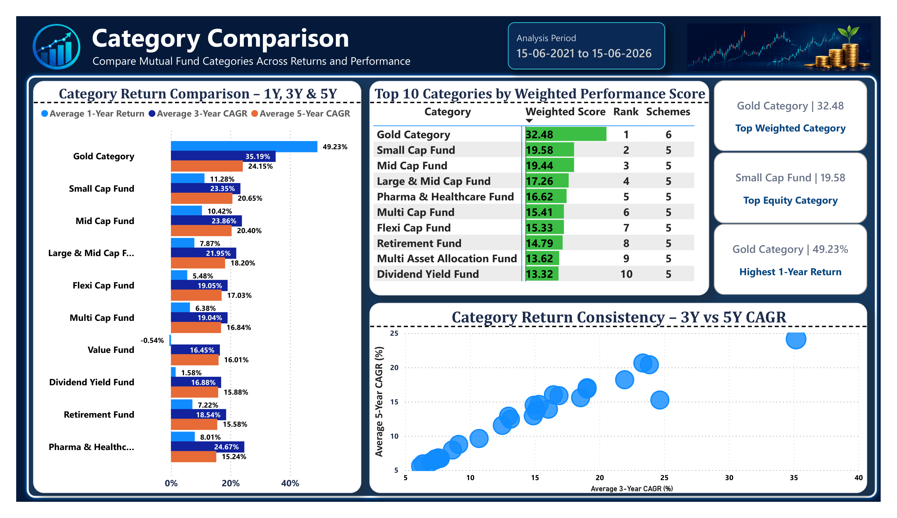
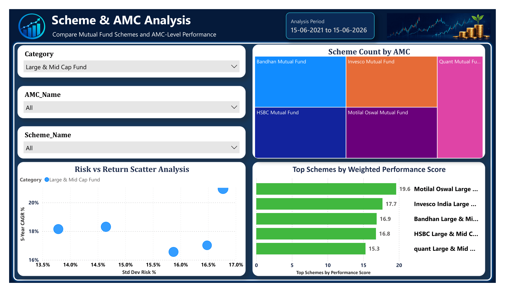
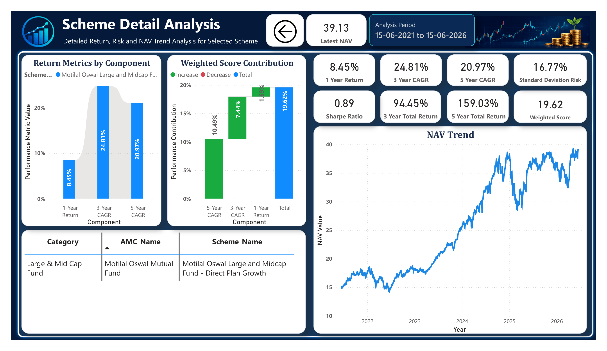

# Mutual Fund Data Analytics Dashboard

## Project Overview

This project analyzes Indian mutual fund schemes using historical NAV data. The objective is to evaluate mutual fund performance across categories, AMCs, and individual schemes using return, CAGR, risk, Sharpe Ratio, and weighted performance score.

The dashboard is built as an end-to-end data analytics project using Python, Excel Power Query, SQL Server, and Power BI.

---

## Dataset Summary

- **Data Source:** MFAPI
- **Analysis Period:** 15-06-2021 to 15-06-2026
- **Total Mutual Fund Schemes:** 156
- **Total Categories:** 31
- **Total AMCs:** 25
- **Total NAV Records:** 1,94,768

---

## Tools & Technologies Used

- **Python** – Data extraction from MFAPI
- **Excel Power Query** – Data cleaning and transformation
- **SQL Server** – Data storage, validation, return calculations, and views
- **Power BI** – Dashboard design, data modeling, DAX measures, and visual analytics

---

## Project Workflow

### 1. Data Collection

Mutual fund scheme master data was collected from MFAPI using Python. Selected mutual fund schemes were then used to download historical NAV data.

Main Python scripts:

```text
Scripts/
├── 01_download_all_schemes_basic.py
└── 02_download_selected_schemes_nav.py
```

---

### 2. Data Cleaning

The raw NAV data was cleaned using Excel Power Query.

Main processed files:

```text
Processed_Data/
├── Processed_NAV_Data.xlsx
├── Processed_NAV_Data_SQL.csv
└── Scheme_Dim.csv
```

Cleaning steps included:

- Removed duplicates
- Corrected data types
- Standardized scheme and category fields
- Prepared SQL-ready CSV file
- Created scheme dimension data

---

### 3. SQL Analysis

SQL Server was used to create tables, validate data, calculate performance metrics, and prepare final reporting views.

Main SQL file:

```text
SQL/MutualFundAnalytics_Full_Updated.sql
```

SQL work included:

- Dataset validation
- Category-wise scheme count
- NAV record count
- Latest NAV calculation
- 1-Year Return
- 3-Year Total Return
- 5-Year Total Return
- 3-Year CAGR
- 5-Year CAGR
- Weighted Performance Score
- Category ranking
- Final Power BI reporting views

> Note: Before running the SQL script on another system, update the local CSV file path in the `BULK INSERT` section.

---

### 4. Power BI Dashboard

Power BI was used to create a four-page interactive dashboard.

Dashboard pages:

1. Overview
2. Category Comparison
3. Scheme & AMC Analysis
4. Scheme Detail Analysis

> Power BI PBIX file is available on request.

---

## Key Metrics Used

- Latest NAV
- 1-Year Return
- 3-Year CAGR
- 5-Year CAGR
- 3-Year Total Return
- 5-Year Total Return
- Standard Deviation Risk
- Sharpe Ratio
- Weighted Performance Score

---

## Weighted Performance Score

The weighted performance score was calculated using:

```text
Weighted Score =
(1-Year Return × 20%) +
(3-Year CAGR × 30%) +
(5-Year CAGR × 50%)
```

This gives higher importance to long-term performance while still considering recent performance.

---

## Dashboard Screenshots

### 1. Overview Page



### 2. Category Comparison Page



### 3. Scheme & AMC Analysis Page



### 4. Scheme Detail Analysis Page



---

## Dashboard Pages Explanation

### Overview

The Overview page provides a high-level summary of the mutual fund dataset, including total AMCs, total schemes, total categories, NAV records, and average return metrics.

It also highlights:

- Top categories by 5-year CAGR
- Top schemes by weighted performance score
- Category and AMC slicers for quick filtering

---

### Category Comparison

This page compares mutual fund categories across 1-year return, 3-year CAGR, 5-year CAGR, and weighted performance score.

It helps identify:

- Best-performing categories
- Category-wise consistency
- Risk-return patterns across categories

---

### Scheme & AMC Analysis

This page allows scheme-level and AMC-level performance comparison.

It includes:

- Category slicer
- AMC slicer
- Scheme slicer
- Scheme count by AMC
- Risk vs return analysis
- Top schemes by performance score

---

### Scheme Detail Analysis

This is a drill-through page for individual scheme analysis.

It includes:

- Latest NAV
- 1-Year Return
- 3-Year CAGR
- 5-Year CAGR
- Standard Deviation Risk
- Sharpe Ratio
- Weighted Performance Score
- NAV trend
- Return component analysis

---

## Key Insights

1. **Gold Category showed the strongest overall weighted performance** during the analysis period.

2. **Small Cap Fund and Mid Cap Fund categories delivered strong long-term CAGR**, showing higher growth potential over the 5-year period.

3. **Large & Mid Cap Fund schemes provided a useful balance between return and risk**, making them suitable for risk-return comparison.

4. **Risk metrics such as Standard Deviation and Sharpe Ratio helped evaluate performance beyond only return values.**

5. **Weighted Performance Score gave a more balanced ranking by combining short-term, medium-term, and long-term performance.**

---

## Folder Structure

```text
Mutual_Fund_Project/
│
├── Logo_Image/
│
├── Power_BI/
│   ├── Screenshots/
│   └── Mutual_Fund_Analytics_Dashboard.pdf
│
├── Processed_Data/
│   ├── Validation_Files/
│   ├── Processed_NAV_Data.xlsx
│   ├── Processed_NAV_Data_SQL.csv
│   └── Scheme_Dim.csv
│
├── Raw_Data/
│   ├── MFAPI_All_Schemes.csv
│   └── Selected_Schemes_NAV_History.csv
│
├── Scripts/
│   ├── 01_download_all_schemes_basic.py
│   └── 02_download_selected_schemes_nav.py
│
├── SQL/
│   ├── MutualFundAnalytics_Full_Updated.sql
│   └── Scheme_Dim_Script.sql
│
├── Mutual_Fund_Master.xlsx
├── requirements.txt
├── .gitignore
└── README.md
```

---

## How to Run This Project

1. Clone or download this repository.

2. Install Python dependencies:

```bash
pip install -r requirements.txt
```

3. Run the Python scripts from the `Scripts` folder to download scheme master data and NAV history.

4. Open the processed Excel file:

```text
Processed_Data/Processed_NAV_Data.xlsx
```

5. Import the SQL-ready CSV into SQL Server using:

```text
Processed_Data/Processed_NAV_Data_SQL.csv
```

6. Run the final SQL script:

```text
SQL/MutualFundAnalytics_Full_Updated.sql
```

7. View the dashboard preview PDF:

```text
Power_BI/Mutual_Fund_Analytics_Dashboard.pdf
```

> For the editable Power BI PBIX file, please contact the author.

---

## Project Outcome

This project demonstrates an end-to-end data analytics workflow for mutual fund performance analysis. It covers data extraction, cleaning, SQL-based analysis, risk-return calculation, performance ranking, and dashboard storytelling using Power BI.

The final dashboard helps compare mutual fund categories, AMCs, and schemes using both return-based and risk-adjusted metrics.

---

## Author

**Ravindra Deo Kuldeep**  
Aspiring Data Analyst  
GitHub: @RavindraKuldeep
Email: ravindra.kuldeep0@gmail.com

---

## Disclaimer

This project is created for data analytics learning and portfolio demonstration purposes only. It should not be considered financial advice or investment recommendation.